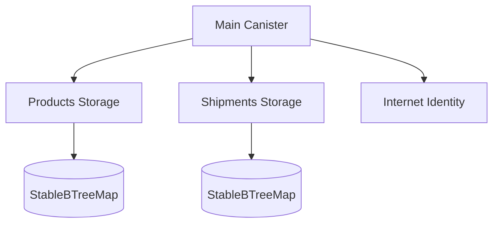
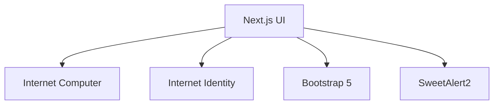

# Cargochain - Supply Chain Management on the Internet Computer

*Decentralized supply chain management powered by the Internet Computer Protocol*

## Overview

Cargochain is a decentralized supply chain management system built on the Internet Computer Protocol (ICP). It enables manufacturers, shippers, and recipients to track products and shipments through a transparent, tamper-proof ledger with fine-grained access control.

Key Benefits:
- **True Ownership**: Users only see and manage products/shipments they created
- **Transparent Tracking**: Immutable record of all supply chain events
- **Decentralized**: No single point of failure or control
- **Identity Integration**: Internet Identity for secure authentication

## Features

### Core Functionality
- **Product Management**
  - Add new products with details
  - Update product information
  - View product history
- **Shipment Tracking**
  - Create shipments between locations
  - Update shipment status (Pending → In Transit → Delivered)
  - Cancel shipments when needed
- **Ownership Control**
  - Strict access rules - only owners can manage their assets
  - Principal-based authentication

### Technical Highlights
- Internet Computer canister smart contracts
- Internet Identity for decentralized authentication
- Tamper-proof record of all transactions
- Responsive web interface with Bootstrap 5
- Real-time status updates

## Technical Architecture

### Backend (Canister)


### Frontend


## Installation

### Prerequisites
- Node.js (v20+)
- DFX SDK (v0.15+)

### Setup Steps

1. **Clone the repository**
```bash
git clone https://github.com/fourWayz/CargoChain.git
cd cargochain
```

2. **Install dependencies**
```bash
npm install

cd client

npm install
```

3. **Start local replica**
```bash
dfx start --background
```

4. **Deploy canisters**
```bash
dfx deploy
```

5. **Run frontend**
```bash
cd client && npm run dev
```

## Usage

### Accessing the Application
1. Navigate to `http://localhost:3000`
2. Click "Login with Internet Identity"
3. Create or select your Internet Identity

### Managing Products
1. **Add Product**: Click "Add Product" button
2. **Update Product**: Click "Update" on product card
3. **View Products**: All your products appear in the dashboard

### Managing Shipments
1. **Create Shipment**: Select product and enter details
2. **Update Status**: Change status as shipment progresses
3. **Cancel Shipment**: Cancel pending shipments when needed

## Deployment

### To IC Mainnet
1. Build production version:
```bash
npm run build
```

2. Deploy canisters:
```bash
dfx deploy --network ic
```

**Cargochain** - Revolutionizing supply chain management with blockchain technology on the Internet Computer.